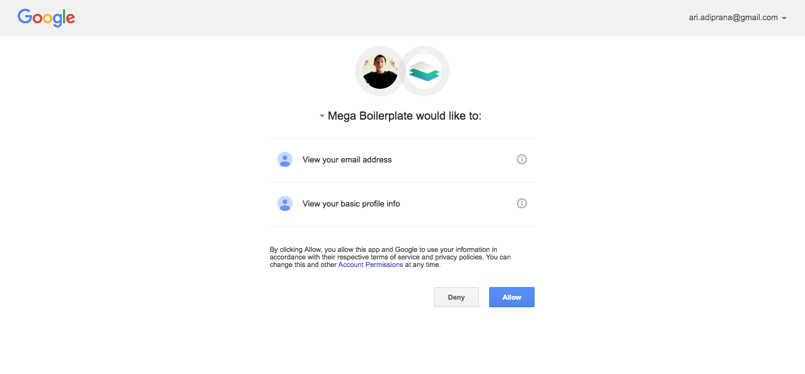
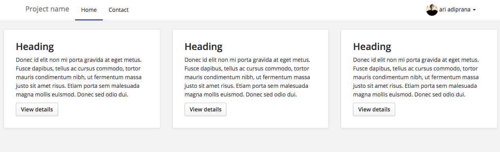

# :fire: 008 Web API Authentication and Authorization :fire:

## Description
This repository is built to fulfill the task from Hacktiv 8 coding bootcamp in phase 2.

By using this application, you can login with your gmail account

This project is build using
- **Bootstrap**
- **Express**
- **Mongodb**
- **Passport**

### How to install
```shell
npm install
npm start
```
### Capture



